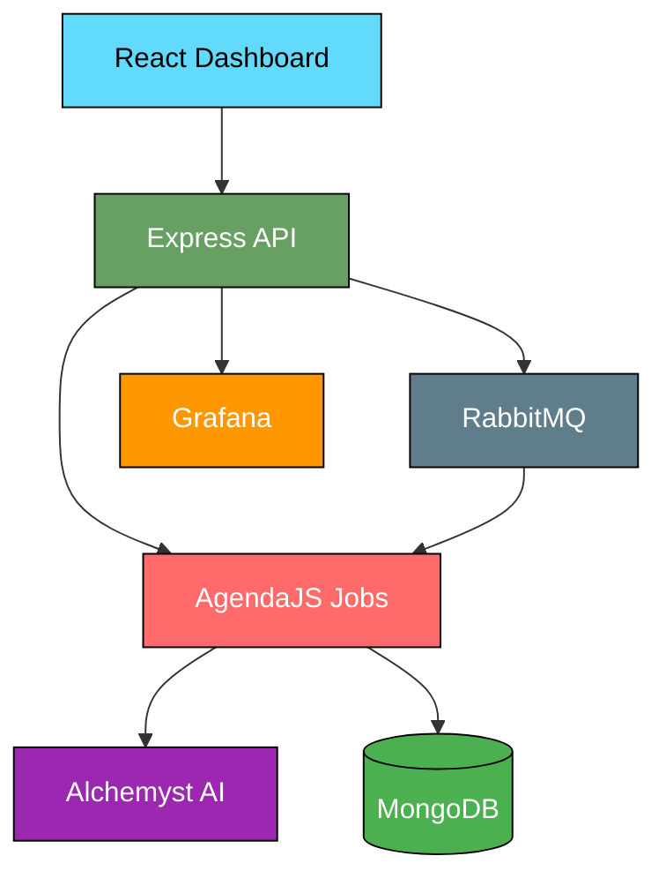
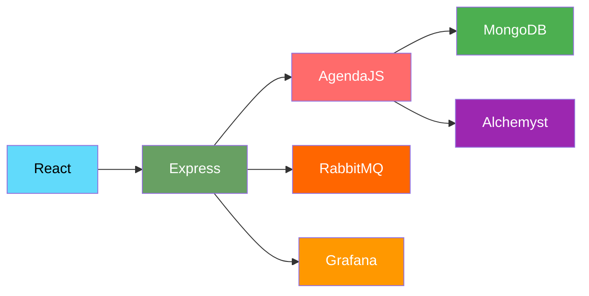

# 🧪 Alchemyst Platform

> **AI-powered research platform** with deep analysis capabilities and real-time monitoring

## 🌐 Live Platform

| Service | URL | Description |
|---------|-----|-------------|
| 🎨 **Frontend** | http://34.68.86.10:3000 | Research Dashboard & Job Submission |
| 🚀 **API** | http://34.68.86.10:8080 | REST API & WebSocket Server |
| 📊 **Grafana** | http://35.209.99.170:3000 | Metrics & Monitoring Dashboard |
| 🐰 **RabbitMQ** | http://35.209.28.176:15672 | Queue Management UI |

## 🏗️ Architecture



## ✨ What It Does

**🔬 Deep Research Agent**
- Multi-step AI research with intelligent planning
- GitHub repository analysis and code review
- Document summarization and synthesis

**📈 Real-time Monitoring**
- Live job progress tracking
- Cost and token usage analytics
- System health dashboards

**⚡ Smart Processing**
- Parallel execution for faster results
- Automatic error recovery and retries
- Cost-optimized token allocation

## 🚀 Quick Start

```bash
# Research something!
curl -X POST http://34.68.86.10:8080/api/jobs \
  -H "Content-Type: application/json" \
  -d '{
    "type": "deep-research",
    "data": {
      "topic": "artificial intelligence in healthcare",
      "researchDepth": "medium"
    }
  }'
```

## 🛠️ Tech Stack



---

**🌟 Deployed on Google Cloud Platform • Built with React + Express.js + MongoDB + RabbitMQ**
